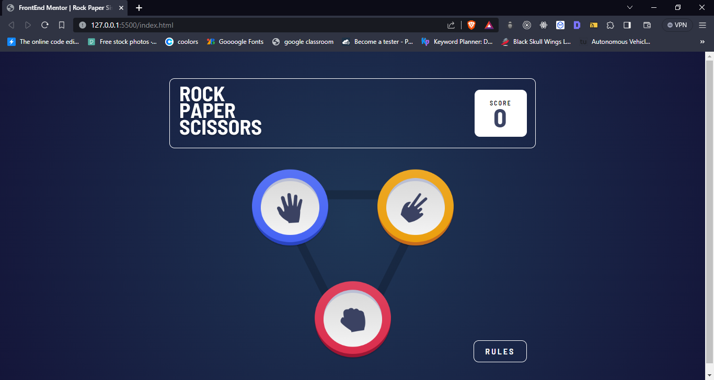
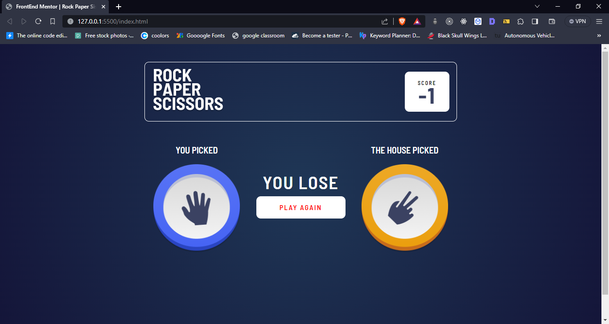
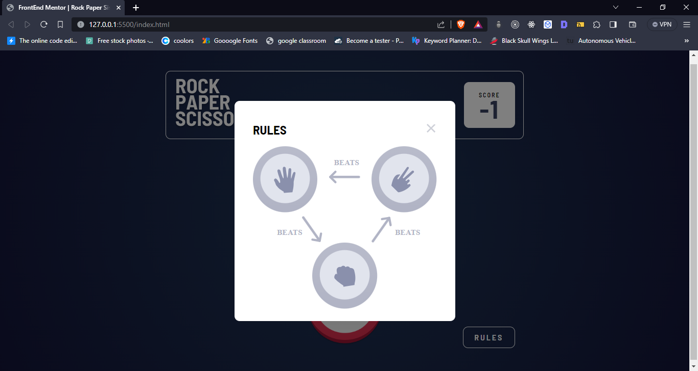
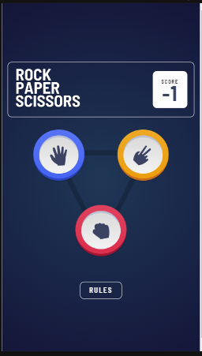
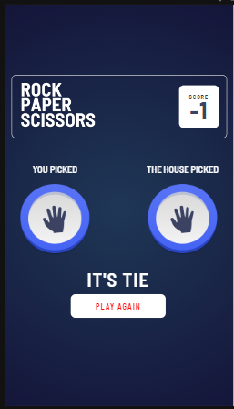
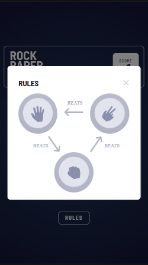

# Frontend Mentor - Rock, Paper, Scissors solution

This is a solution to the [Rock, Paper, Scissors challenge on Frontend Mentor](https://www.frontendmentor.io/challenges/rock-paper-scissors-game-pTgwgvgH). Frontend Mentor challenges help you improve your coding skills by building realistic projects.

## Table of contents

- [Overview](#overview)
  - [The challenge](#the-challenge)
  - [Screenshot](#screenshot)
  - [Links](#links)
- [My process](#my-process)
  - [Built with]
- [Author] Aditya Ashok Mane

## Overview

### The challenge

Users should be able to:

- View the optimal layout for the game depending on their device's screen size
- Play Rock, Paper, Scissors against the computer
- Maintain the state of the score after refreshing the browser

### Screenshot

### Links

- Solution URL: [Add solution URL here](https://your-solution-url.com)
- Live Site URL: [Add live site URL here](https://your-live-site-url.com)

## My process

### Built with

- HTML
- CSS
- JAVASCRIPT
- CSS custom properties
- Flexbox
- Mobile-first workflow
- animista for animation

### Useful resources

- [mdn web docs](https://developer.mozilla.org/en-US/docs/Web/HTML/Element/dialog) - I learned about the dialog tag

## Author

- Website - [Aditya Ashok Mane]
- Frontend Mentor - [@Aditya-Mane007](https://www.frontendmentor.io/profile/Aditya-Mane007)
- Twitter - [@AdityaM52821612](https://twitter.com/AdityaM52821612)
- Linkdin - [Aditya Ashok Mane](https://www.linkedin.com/in/aditya-mane-562b52269/)

